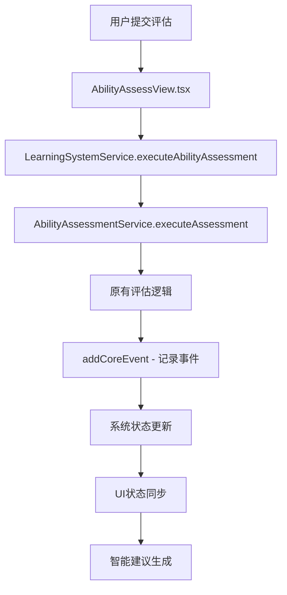

# 🧠 能力评估系统与Learning System统一架构集成指南

## 🏗️ 系统架构升级概览

能力评估系统现已完全集成到Learning System统一架构中，确保与其他子环节（目标设定、路径规划、课程内容）的无缝协调。

### 统一架构层次

```
用户交互层 (UI Components)
    ↓
能力评估页面 (AbilityAssessView.tsx)
    ↓
Learning System协调层 (LearningSystemService)
    ↓
专业模块层 (AbilityAssessmentService)
    ↓
核心数据层 (CoreData Service)
    ↓
数据存储层 (localStorage)
```

## 🔧 核心集成特性

### 1. 统一的Learning System服务调用

能力评估现通过Learning System服务执行，确保：
- **数据一致性**: 所有评估数据都通过统一的API管理
- **状态同步**: 评估完成自动触发系统状态更新
- **事件追踪**: 完整的评估生命周期事件记录

```typescript
// 在AbilityAssessView.tsx中
const result = await learningSystemService.executeAbilityAssessment(input)
setAssessment(result.assessment)
setSystemStatus(result.systemStatus)
```

### 2. AbilityAssessmentService封装

新创建的AbilityAssessmentService提供完整的评估管理功能：

```typescript
export class AbilityAssessmentService {
  // 执行评估
  async executeAssessment(input: AssessmentInput): Promise<AbilityAssessment>
  
  // 获取当前评估
  getCurrentAssessment(): AbilityAssessment | null
  
  // 更新评估结果
  async updateAssessment(updates: Partial<AbilityAssessment>): Promise<AbilityAssessment | null>
  
  // 生成提升计划
  async generateImprovementPlan(assessment?: AbilityAssessment): Promise<string>
  
  // 导出评估报告
  exportReport(assessment?: AbilityAssessment): string
  
  // 分析薄弱领域
  analyzeWeakAreas(assessment?: AbilityAssessment)
  
  // 获取能力概述
  getAbilitySummary()
}
```

### 3. 系统状态实时显示

评估页面集成了完整的Learning System状态监控：

```typescript
interface LearningSystemStatus {
  setupComplete: boolean
  currentPhase: 'assessment' | 'goal_setting' | 'path_planning' | 'learning' | 'review'
  progress: {
    hasAbilityProfile: boolean
    activeGoals: number
    activePaths: number
    completedNodes: number
    totalNodes: number
    overallProgress: number
  }
  recommendations: string[]
  nextActions: string[]
}
```

## 📊 UI界面升级

### 新增的统一管理界面

1. **系统状态卡片**
   - 当前学习阶段显示
   - 设置完成度追踪
   - 整体进度可视化
   - 各模块状态概览

2. **智能建议系统**
   - 基于评估结果的下一步操作建议
   - 跨模块的导航引导
   - 学习路径优化提醒

3. **统一操作提示**
   - 评估完成后的智能引导
   - 直接跳转到目标设定和路径管理
   - 系统状态刷新功能

## 🔄 数据流集成

### 评估执行流程



### 状态同步机制

1. **评估完成** → **系统阶段转换** (assessment → goal_setting)
2. **评估更新** → **相关模块状态重新计算**
3. **评估数据** → **目标推荐和路径规划的基础输入**

## 🛠️ 技术实现细节

### 1. Learning System集成

```typescript
// 在LearningSystemService中新增方法
async executeAbilityAssessment(input: any): Promise<any> {
  const assessment = await this.abilityService.executeAssessment(input)
  const systemStatus = await this.getSystemStatus()
  
  return {
    assessment,
    systemStatus,
    nextRecommendations: systemStatus.recommendations,
    message: '能力评估完成！系统已为您分析当前技能水平，可以开始设定学习目标。'
  }
}

// 统一的能力概述接口
getAbilitySummary() {
  return this.abilityService.getAbilitySummary()
}
```

### 2. 系统状态计算升级

```typescript
// 系统状态计算现在使用统一的能力概述
async getSystemStatus(): Promise<LearningSystemStatus> {
  const abilitySummary = this.abilityService.getAbilitySummary()
  
  // 基于能力概述而不是原始数据进行状态计算
  let currentPhase = 'assessment'
  if (abilitySummary.hasAssessment && activeGoals.length === 0) {
    currentPhase = 'goal_setting'
  }
  // ... 其他阶段判断
}
```

### 3. 事件系统集成

```typescript
// AbilityAssessmentService中的事件记录
addCoreEvent({
  type: 'ability_assessment_completed',
  data: {
    method: input.type,
    overallScore: assessment.overallScore,
    level: getScoreLevel(assessment.overallScore),
    assessmentDate: assessment.metadata.assessmentDate
  }
})
```

## 📈 用户体验提升

### 1. 统一的界面风格
- **一致的状态显示**: 所有页面都显示统一的系统状态
- **智能导航**: 评估完成后提供明确的下一步操作
- **实时反馈**: 操作结果立即反映到系统状态

### 2. 智能操作引导
- **阶段感知**: 系统知道用户处于评估阶段
- **个性化建议**: 基于评估结果提供针对性建议
- **无缝跳转**: 一键跳转到相关功能页面

### 3. 数据透明化
- **完整的状态追踪**: 用户可以清楚地看到评估对整个系统的影响
- **进度可视化**: 直观显示评估在学习流程中的位置
- **智能提醒**: 系统会提示需要完善的部分

## 🎯 系统优势

### 1. 数据一致性保证
- **单一数据源**: 所有评估数据都通过统一的Service管理
- **原子操作**: 评估的执行、更新都是完整的事务
- **状态同步**: 评估变化自动触发相关模块更新

### 2. 模块间协调
- **智能依赖**: 系统知道评估与其他模块的依赖关系
- **自动同步**: 评估完成会自动影响目标推荐和路径规划
- **冲突检测**: 系统会检测并解决模块间的状态冲突

### 3. 用户体验优化
- **统一界面**: 所有模块都有一致的状态显示
- **智能引导**: 系统会主动提供有用的操作建议
- **流程连贯**: 从评估到学习的完整流程无缝衔接

## 🔍 验证方法

### 1. 数据一致性验证
```bash
# 1. 在能力评估页面完成评估
# 2. 查看系统状态是否正确更新
# 3. 切换到其他页面验证数据同步
# 4. 检查数据检查器中的事件记录
```

### 2. 状态同步验证
```bash
# 1. 完成能力评估
# 2. 观察系统阶段从assessment转换到goal_setting
# 3. 验证智能建议是否基于评估结果生成
# 4. 测试跳转到目标设定功能
```

### 3. 系统集成验证
```bash
# 1. 完成完整的学习流程设置
# 2. 在能力评估页面查看系统状态
# 3. 验证各项指标是否正确反映
# 4. 测试评估更新对系统状态的影响
```

## 💡 最佳实践

### 1. 开发指导
- **优先使用Learning System服务**: 而不是直接调用AbilityAssessmentService
- **保持状态同步**: 任何评估变化都要通过统一的API
- **完整的错误处理**: 确保评估系统的稳定性

### 2. 用户指导
- **按系统提示操作**: 遵循系统建议的学习阶段
- **关注系统状态**: 定期查看系统状态了解整体进度
- **保持数据完整**: 完善评估信息以获得更好的系统体验

### 3. 数据管理
- **定期备份**: 重要的评估数据应该及时备份
- **状态监控**: 定期查看系统状态确保一切正常
- **及时同步**: 如果发现数据不一致，使用刷新功能同步

## 🚀 未来扩展

### 1. 更深度的集成
- **AI驱动的评估优化**: 基于学习表现动态调整评估权重
- **智能重评估提醒**: 根据学习进度提醒用户重新评估
- **评估历史分析**: 追踪能力发展轨迹

### 2. 更丰富的功能
- **多维度评估**: 支持项目经验、团队协作等更多维度
- **评估结果对比**: 历史评估结果的详细对比分析
- **能力成长建议**: 基于评估结果的具体成长路径

### 3. 更好的用户体验
- **可视化改进**: 更丰富的评估结果展示
- **交互优化**: 更流畅的评估流程体验
- **移动端适配**: 支持移动设备的评估功能

## 📊 架构对比

### 集成前 (独立架构)
```
AbilityAssessView → analyzeAbility → AI评估 → localStorage
                ↓
           ProfileSettings (记录活动)
```

### 集成后 (统一架构)
```
AbilityAssessView → LearningSystemService → AbilityAssessmentService → AI评估 → CoreData → localStorage
                                    ↓                                              ↓
                            SystemStatus更新                                 事件记录
                                    ↓                                              ↓
                            智能建议生成                                    模块间同步
```

## 🎉 集成效果

通过这次集成，能力评估系统实现了：

✅ **架构统一**: 与目标设定、路径规划、课程内容使用相同的架构模式  
✅ **数据一致**: 所有评估数据都通过统一的数据流管理  
✅ **状态同步**: 评估状态变化自动同步到整个学习系统  
✅ **智能引导**: 评估完成后提供明确的下一步操作建议  
✅ **用户体验**: 统一的界面风格和交互模式  

现在，所有四个核心子系统（能力评估、目标设定、路径规划、课程内容）都已完全集成到Learning System统一架构中，为用户提供了真正一体化的学习管理体验！

---

**🎯 通过这个统一的架构集成，能力评估不再是孤立的功能，而是整个学习系统的重要基础，为后续的目标设定和路径规划提供可靠的数据支撑！** 🚀 