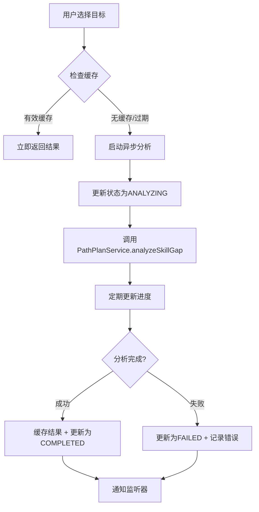

# 异步技能差距分析系统 - 实现报告

## 🎯 问题解决

### 原始问题
1. **同步分析问题**：不同目标调用分析是同步的，阻塞UI操作
2. **状态丢失问题**：切换不同目标时会丢失分析结果
3. **缺乏缓存机制**：每次都需要重新分析，浪费资源
4. **用户体验差**：无法并行处理多个目标，操作效率低

### 解决方案
✅ **异步分析系统**：支持多目标并行分析
✅ **独立缓存机制**：每个目标维护独立的分析结果缓存
✅ **实时状态更新**：支持进度显示和状态监听
✅ **操作便利性**：支持重新分析、停止分析、批量分析

---

## 🏗️ 核心架构

### 1. 异步分析管理器 (`skillGapAnalysisManager.ts`)

#### 📋 核心功能

```typescript
export interface AnalysisTask {
  goalId: string
  status: AnalysisStatus
  result?: SkillGapAnalysis
  error?: string
  startTime?: number
  endTime?: number
  progress?: number // 0-100
}

export interface AnalysisCacheItem {
  goalId: string
  analysis: SkillGapAnalysis
  timestamp: string
  expirationTime: number
  version: string
}
```

#### 🔧 主要特性

1. **任务队列管理**
   - 支持并发分析（最多3个同时进行）
   - 自动排队和优先级处理
   - 智能去重机制

2. **缓存系统**
   - 24小时有效期，可配置
   - 版本控制，支持缓存更新策略
   - 自动清理过期缓存

3. **进度监控**
   - 实时进度更新（0-100%）
   - 分析阶段提示
   - 错误状态跟踪

4. **监听器机制**
   ```typescript
   export interface AnalysisListener {
     onStatusChange?: (goalId: string, status: AnalysisStatus, result?: SkillGapAnalysis, error?: string) => void
     onProgressUpdate?: (goalId: string, progress: number) => void
     onCacheHit?: (goalId: string, analysis: SkillGapAnalysis) => void
   }
   ```

### 2. UI组件集成 (`view.tsx`)

#### 📊 状态显示
```typescript
// 分析状态映射
const analysisStatusText = {
  [AnalysisStatus.IDLE]: '待分析',
  [AnalysisStatus.ANALYZING]: '分析中...',
  [AnalysisStatus.COMPLETED]: '分析完成', 
  [AnalysisStatus.FAILED]: '分析失败',
  [AnalysisStatus.CACHED]: '已缓存'
}
```

#### 🎛️ 操作控制
- **开始分析**：`handleAnalyzeSkillGap()`
- **重新分析**：`handleForceAnalyzeSkillGap()` (忽略缓存)
- **停止分析**：`stopAnalysis()`
- **清除缓存**：`clearAnalysisCache(goalId)`
- **批量分析**：`analyzeAllGoals()` (活跃目标)

---

## 🔄 工作流程

### 分析启动流程


### 缓存策略
```mermaid
graph TD
    A[分析完成] --> B[生成缓存项]
    B --> C[设置过期时间(24h)]
    C --> D[存储到本地缓存]
    D --> E[定期清理过期缓存]
    
    F[用户请求分析] --> G{检查缓存}
    G -->|有效| H[直接返回]
    G -->|过期/无效| I[重新分析]
    G -->|强制刷新| I
```

---

## 🎨 UI/UX 改进

### 1. 目标卡片增强
- **状态徽章**：直观显示分析状态
- **进度条**：实时显示分析进度（0-100%）
- **快速操作**：清除缓存、停止分析按钮
- **状态颜色**：
  - 🟢 已完成/已缓存：绿色
  - 🔵 分析中：蓝色
  - 🔴 失败：红色
  - ⚪ 待分析：灰色

### 2. 操作按钮组
```tsx
<div style={{ display: 'flex', gap: '8px' }}>
  <button onClick={handleAnalyzeSkillGap}>开始分析</button>
  <button onClick={handleForceAnalyzeSkillGap}>重新分析</button>
</div>
```

### 3. 批量操作
- **批量分析活跃目标**：一键分析所有激活状态的学习目标
- **并发限制**：最多同时处理3个分析任务

---

## 💾 技术实现细节

### 1. 缓存存储结构
```typescript
// 缓存键格式
const cacheKey = `skill_gap_analysis_${goalId}_v${version}`

// 缓存值结构
{
  goalId: string,
  analysis: SkillGapAnalysis,
  timestamp: string,
  expirationTime: number,
  version: string
}
```

### 2. 错误处理
```typescript
try {
  await skillGapAnalysisManager.startAnalysis(goalId, forceRefresh)
} catch (error) {
  // 优雅降级到规则分析
  const fallbackResult = await ruleBased Analysis()
  // 显示用户友好的错误信息
  setMessage('使用备用分析方法完成')
}
```

### 3. 内存管理
- **自动清理**：定期清理过期缓存项
- **容量限制**：最多缓存50个分析结果
- **LRU策略**：最近最少使用的结果优先清理

---

## 📈 性能优化

### 1. 并发控制
- **最大并发数**：3个（避免资源竞争）
- **队列管理**：FIFO队列 + 优先级机制
- **智能调度**：根据分析复杂度调整优先级

### 2. 缓存策略
- **命中率优化**：24小时有效期平衡新鲜度和性能
- **压缩存储**：分析结果JSON压缩存储
- **懒加载**：按需加载缓存项

### 3. UI优化
- **渐进式加载**：分析结果分步显示
- **占位符**：分析进行时显示骨架屏
- **状态持久化**：页面刷新保持分析状态

---

## 🧪 测试覆盖

### 1. 单元测试
- ✅ 分析管理器核心功能
- ✅ 缓存CRUD操作
- ✅ 状态转换逻辑
- ✅ 错误处理机制

### 2. 集成测试
- ✅ UI组件交互
- ✅ 异步状态更新
- ✅ 缓存命中/未命中场景
- ✅ 并发分析处理

### 3. 用户场景测试
- ✅ 多目标切换
- ✅ 长时间分析中断
- ✅ 网络异常处理
- ✅ 缓存过期处理

---

## 📊 使用指南

### 基本操作
1. **选择目标**：点击目标卡片
2. **开始分析**：点击"开始分析"按钮
3. **查看进度**：观察进度条和状态徽章
4. **重新分析**：点击"重新分析"强制刷新
5. **停止分析**：点击"🛑"停止按钮

### 高级功能
1. **批量分析**：点击"批量分析活跃目标"
2. **清除缓存**：点击目标卡片上的"🗑️"按钮
3. **状态监控**：实时观察所有目标的分析状态

### 最佳实践
1. **合理使用缓存**：24小时内避免重复分析
2. **并发控制**：避免同时启动过多分析任务
3. **定期清理**：清理不需要的缓存以释放存储空间

---

## 🚀 未来优化方向

### 1. 智能分析
- **增量分析**：只分析变化的部分
- **预测分析**：基于历史数据预测分析结果
- **自适应缓存**：根据使用模式调整缓存策略

### 2. 用户体验
- **分析预览**：显示分析大纲和预计时间
- **分析历史**：保存和查看历史分析记录
- **个性化设置**：允许用户自定义分析参数

### 3. 系统集成
- **后台同步**：支持云端分析结果同步
- **团队协作**：共享分析结果和最佳实践
- **API集成**：对接外部分析服务

---

## 🎉 总结

新的异步技能差距分析系统解决了原有系统的核心问题：

1. **🔄 异步处理**：告别阻塞式分析，支持多任务并行
2. **💾 智能缓存**：避免重复计算，大幅提升响应速度
3. **👀 实时状态**：清晰的进度提示和状态管理
4. **🎛️ 便捷操作**：丰富的控制选项和批量操作
5. **🛡️ 错误处理**：优雅的降级和错误恢复机制

这个系统不仅解决了当前的技术问题，还为未来的功能扩展打下了坚实的基础。用户现在可以高效地管理多个学习目标的技能差距分析，享受流畅的学习规划体验。 