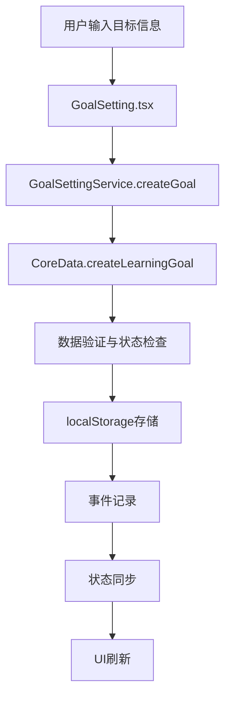

# 🎯 目标设定页面与Learning System统一架构集成指南

## 🏗️ 系统架构概览

目标设定页面现已完全集成到Learning System统一架构中，确保与其他子环节（能力评估、路径规划、课程内容）的无缝协调。

### 统一架构层次

```
用户交互层 (UI Components)
    ↓
目标设定页面 (GoalSetting.tsx)
    ↓
Learning System协调层 (LearningSystemService)
    ↓
专业模块层 (GoalSettingService, PathPlanService, CourseContentService)
    ↓
核心数据层 (CoreData Service)
    ↓
数据存储层 (localStorage)
```

## 🔧 核心集成特性

### 1. 统一的Learning System服务调用

目标设定页面通过Learning System服务创建目标，确保：
- **数据一致性**: 所有目标数据都通过统一的API管理
- **状态同步**: 目标状态变化自动同步到路径和课程模块
- **事件追踪**: 完整的目标生命周期事件记录

```typescript
// 在GoalSetting.tsx中
const goalService = new GoalSettingService()
await goalService.createGoal(goalRecommendation)
```

### 2. 系统状态实时显示

页面集成了完整的Learning System状态监控：

```typescript
interface LearningSystemStatus {
  setupComplete: boolean
  currentPhase: 'assessment' | 'goal_setting' | 'path_planning' | 'learning' | 'review'
  progress: {
    hasAbilityProfile: boolean
    activeGoals: number
    activePaths: number
    completedNodes: number
    totalNodes: number
    overallProgress: number
  }
  recommendations: string[]
  nextActions: string[]
}
```

### 3. 跨模块数据共享

- **能力评估集成**: 目标创建时自动考虑用户能力水平
- **路径规划联动**: 目标状态变化触发相关路径状态同步
- **课程内容关联**: 目标完成度影响课程内容推荐

## 📊 UI界面升级

### 新增的统一管理界面

1. **系统状态卡片**
   - 当前学习阶段显示
   - 设置完成度追踪
   - 整体进度可视化
   - 各模块状态概览

2. **智能建议系统**
   - 基于系统状态的个性化建议
   - 跨模块的操作指导
   - 学习路径优化提醒

3. **目标状态统计**
   - 现代化的卡片设计
   - 直观的数据可视化
   - 激活限制智能提醒

## 🔄 数据流集成

### 目标创建流程



### 状态同步机制

1. **目标状态变化** → **相关路径状态同步**
2. **路径节点完成** → **目标进度更新**
3. **能力评估更新** → **目标难度调整建议**

## 🛠️ 技术实现细节

### 1. GoalSettingService集成

```typescript
// 使用统一的目标创建服务
const goalRecommendation: GoalRecommendation = {
  category: formData.category,
  title: formData.title,
  description: formData.description,
  priority: formData.priority,
  reasoning: '用户手动创建的学习目标',
  estimatedTimeWeeks: formData.estimatedTimeWeeks,
  requiredSkills: formData.requiredSkills,
  outcomes: formData.outcomes
}

const goalService = new GoalSettingService()
await goalService.createGoal(goalRecommendation)
```

### 2. 系统状态获取

```typescript
// 获取完整的学习系统状态
const status = await learningSystemService.getSystemStatus()
setSystemStatus(status)
```

### 3. 智能建议系统

```typescript
// 系统会基于当前状态提供智能建议
if (!systemStatus.progress.hasAbilityProfile) {
  recommendations.push('完成能力评估')
}
if (systemStatus.progress.activeGoals === 0) {
  recommendations.push('创建学习目标')
}
```

## 📈 用户体验提升

### 1. 统一的状态管理
- **一致的数据显示**: 所有界面显示的数据都来自统一的数据源
- **实时状态同步**: 任何模块的变化都会立即反映到相关界面
- **智能状态提示**: 系统主动提示用户当前应该进行的操作

### 2. 智能操作指导
- **阶段感知**: 系统知道用户处于哪个学习阶段
- **个性化建议**: 基于用户的完整学习档案提供建议
- **操作优先级**: 系统会告诉用户最重要的下一步操作

### 3. 数据透明化
- **完整的状态追踪**: 用户可以清楚地看到学习系统的各个方面
- **进度可视化**: 直观显示各个模块的完成情况
- **问题诊断**: 系统会主动识别并提示需要完善的部分

## 🎯 系统优势

### 1. 数据一致性保证
- **单一数据源**: 所有目标数据都通过统一的API管理
- **原子操作**: 目标的创建、更新、删除都是完整的事务
- **状态同步**: 目标状态变化自动触发相关模块更新

### 2. 模块间协调
- **智能依赖**: 系统知道各模块间的依赖关系
- **自动同步**: 一个模块的变化会自动影响相关模块
- **冲突检测**: 系统会检测并解决模块间的状态冲突

### 3. 用户体验优化
- **统一界面**: 所有模块都有一致的设计语言
- **智能提示**: 系统会主动提供有用的操作建议
- **进度追踪**: 用户可以清楚地看到整体学习进度

## 🔍 验证方法

### 1. 数据一致性验证
```bash
# 1. 在目标设定页面创建目标
# 2. 切换到数据检查器页面
# 3. 验证目标数据是否正确保存
# 4. 切换到学习路径管理页面
# 5. 验证目标是否正确显示
```

### 2. 状态同步验证
```bash
# 1. 创建目标并生成路径
# 2. 在目标设定页面暂停目标
# 3. 切换到学习路径管理页面
# 4. 验证相关路径是否同步暂停
```

### 3. 系统状态验证
```bash
# 1. 完成能力评估
# 2. 创建学习目标
# 3. 生成学习路径
# 4. 在目标设定页面查看系统状态
# 5. 验证各项指标是否正确
```

## 💡 最佳实践

### 1. 开发指导
- **优先使用Learning System服务**: 而不是直接调用CoreData
- **保持状态同步**: 任何数据变化都要通过统一的API
- **完整的错误处理**: 确保系统的稳定性

### 2. 用户指导
- **按阶段使用**: 建议用户按照系统提示的阶段进行操作
- **关注系统建议**: 系统的建议基于完整的学习档案分析
- **保持数据完整**: 尽量完善所有相关信息以获得更好的体验

### 3. 数据管理
- **定期备份**: 重要的学习数据应该及时备份
- **状态监控**: 定期查看系统状态确保一切正常
- **及时同步**: 如果发现数据不一致，使用刷新功能同步

## 🚀 未来扩展

### 1. 更深度的集成
- **AI驱动的目标推荐**: 基于能力评估自动生成目标建议
- **智能学习路径调整**: 根据目标变化自动调整学习路径
- **个性化内容生成**: 基于目标特点生成定制化学习内容

### 2. 更丰富的功能
- **目标依赖管理**: 支持目标间的依赖关系
- **学习时间规划**: 基于目标优先级智能安排学习时间
- **成果追踪**: 更详细的学习成果记录和展示

### 3. 更好的用户体验
- **可视化改进**: 更丰富的图表和可视化展示
- **交互优化**: 更流畅的用户操作体验
- **移动端适配**: 支持移动设备的学习管理

---

**🎯 通过这个统一的架构集成，目标设定不再是孤立的功能，而是整个学习系统的重要组成部分，为用户提供更加连贯和智能的学习体验！** 🚀 