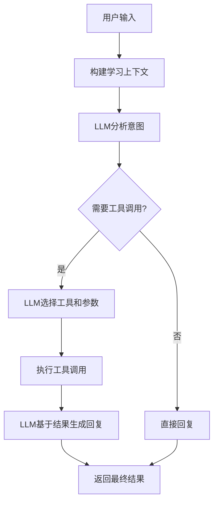

# 🤖 基于LLM的智能工具调度系统

## 🎯 重大改进

本次更新将AI助手从**简单的规则匹配**升级为**基于大语言模型的智能工具调度**，实现了真正的AI驱动工具选择。

## 🔄 系统架构对比

### ❌ 原来的规则驱动系统
```typescript
// 基于关键词匹配的简单意图识别
const intents = [
  {
    type: 'query_goals',
    keywords: ['我的目标', '有哪些目标', '查看目标'],  // 硬编码关键词
    tools: ['get_learning_goals']
  }
]

// 问题：容易误判，缺乏上下文理解
if (userMessage.includes('目标')) {
  return 'get_learning_goals'
}
```

### ✅ 新的LLM驱动系统
```typescript
// 使用大语言模型进行智能工具选择
const result = await getAIResponseWithTools(
  userMessage,           // 用户输入
  contextInfo,           // 完整的学习上下文
  AGENT_TOOLS,          // 所有可用工具的schema
  agentToolExecutor     // 工具执行器
)

// LLM自动：
// 1. 理解用户意图和上下文
// 2. 选择最合适的工具组合
// 3. 生成正确的参数
// 4. 基于结果生成自然语言回复
```

## 🛠️ 技术实现

### 1. Function Calling API集成

支持三大主流LLM的function calling：

#### OpenAI GPT-4
```typescript
{
  model: 'gpt-4o',
  tools: [
    {
      type: 'function',
      function: {
        name: 'get_learning_goals',
        description: '获取用户的所有学习目标列表',
        parameters: {
          type: 'object',
          properties: {
            status: {
              type: 'string',
              enum: ['active', 'completed', 'paused', 'all'],
              description: '目标状态筛选'
            }
          }
        }
      }
    }
  ],
  tool_choice: 'auto'
}
```

#### Claude 3.5 Sonnet
```typescript
{
  model: 'claude-3-5-sonnet-20241022',
  tools: [
    {
      name: 'get_learning_goals',
      description: '获取用户的所有学习目标列表',
      input_schema: {
        type: 'object',
        properties: {
          status: {
            type: 'string',
            enum: ['active', 'completed', 'paused', 'all']
          }
        }
      }
    }
  ]
}
```

#### 通义千问
```typescript
{
  model: 'qwen-turbo',
  input: {
    tools: [
      {
        type: 'function',
        function: {
          name: 'get_learning_goals',
          description: '获取用户的所有学习目标列表',
          parameters: {
            type: 'object',
            properties: {
              status: { type: 'string', enum: ['active', 'completed', 'paused', 'all'] }
            }
          }
        }
      }
    ]
  }
}
```

### 2. 智能工具执行流程



### 3. 完整的22个AI工具支持

所有工具都完整支持LLM调用：

#### 📊 查询类工具 (5个)
- `get_learning_goals` - 获取学习目标
- `get_learning_paths` - 获取学习路径  
- `get_course_units` - 获取课程内容
- `get_learning_summary` - 获取学习摘要
- `get_learning_context` - 获取学习上下文

#### 🎯 管理类工具 (10个)
- `create_learning_goal` - 创建学习目标
- `update_learning_goal` - 更新学习目标
- `delete_learning_goal` - 删除学习目标
- `create_learning_path` - 创建学习路径
- `update_learning_path` - 更新学习路径
- `delete_learning_path` - 删除学习路径
- `create_course_unit` - 创建课程单元
- `update_course_unit` - 更新课程单元
- `delete_course_unit` - 删除课程单元
- `generate_path_nodes` - 生成路径节点

#### 🧠 智能分析工具 (7个)
- `analyze_user_ability` - 分析用户能力
- `calculate_skill_gap` - 计算技能差距
- `suggest_next_action` - 建议下一步行动
- `track_learning_progress` - 跟踪学习进度
- `adjust_learning_pace` - 调整学习节奏
- `handle_learning_difficulty` - 处理学习困难
- `recommend_study_schedule` - 推荐学习计划

## 🎯 用户体验提升

### 智能意图理解

**以前**：只能识别简单关键词
- ❌ "我的目标" → 可能识别
- ❌ "我想看看我设定了什么学习计划" → 无法识别

**现在**：完全理解自然语言
- ✅ "我的目标" → `get_learning_goals`
- ✅ "我想看看我设定了什么学习计划" → `get_learning_goals`
- ✅ "能帮我检查一下我的学习进度吗？" → `get_learning_summary`
- ✅ "我觉得学习太快了，能不能调慢一点？" → `adjust_learning_pace`

### 智能工具组合

LLM可以同时调用多个工具：
```typescript
// 用户："给我一个完整的学习状态报告"
// LLM自动调用：
[
  'get_learning_goals',      // 获取目标
  'get_learning_paths',      // 获取路径
  'get_learning_summary',    // 获取摘要
  'analyze_user_ability'     // 分析能力
]
```

### 上下文感知

LLM完全了解用户的学习状态：
- 📊 能力评估结果
- 🎯 学习目标和进度
- 🛤️ 学习路径状态
- 💬 对话历史
- 📈 学习统计

## 🧪 测试指南

### 1. 启用LLM工具调度

确保在Profile设置中配置了API Key：
```bash
Dashboard → Profile设置 → API配置
选择模型：OpenAI GPT-4 / Claude 3.5 / 通义千问
输入API Key
```

### 2. 测试智能查询

尝试各种自然语言查询：

#### 📋 目标相关
```
"我现在有哪些学习目标？"
"帮我看看我的学习计划"
"我设定了什么目标？"
"查询我的目标状态"
```

#### 🛤️ 路径相关
```
"我的学习路径怎么样？"
"帮我检查学习路径的进度"
"我有几条学习路径？"
"显示我的学习计划"
```

#### 📊 进度相关
```
"我的学习进度如何？"
"给我一个学习报告"
"我完成了多少内容？"
"学习统计数据"
```

#### 🎯 综合查询
```
"给我一个完整的学习状态概览"
"分析一下我的当前情况"
"我应该接下来做什么？"
```

### 3. 观察工具调用

在对话中你会看到：
- 🔧 **工具标识**：显示AI使用了哪些工具
- 📊 **结构化结果**：基于真实数据的回复
- 💡 **智能建议**：基于分析结果的个性化建议

## 🔍 调试和验证

### 1. 查看工具调用日志
打开浏览器开发者工具：
```bash
Console → 搜索 "[AIAssistant] Executing tool"
查看实际调用的工具和参数
```

### 2. 验证数据一致性
```bash
AI智能对话 → 询问"我的学习目标"
数据检查器 → 查看实际存储的目标数据
确认一致性
```

### 3. 测试错误处理
```bash
# 测试API限额
连续发送多条消息

# 测试网络错误
断开网络后发送消息

# 观察回退机制
检查是否有友好的错误提示
```

## 🎉 优势总结

### 🧠 智能化
- **真正理解用户意图**：不再依赖关键词匹配
- **上下文感知**：基于完整学习状态进行回复
- **自然语言交互**：支持各种表达方式

### 🔧 功能强大
- **22个AI工具**：完整的学习管理功能
- **智能工具组合**：自动选择最合适的工具
- **参数智能生成**：LLM自动生成正确参数

### 🚀 用户体验
- **零学习成本**：用自然语言就能操作
- **高效交互**：一句话完成复杂操作
- **个性化回复**：基于真实数据的精准回复

### 🔄 可扩展性
- **新工具易添加**：只需定义schema
- **多模型支持**：OpenAI、Claude、通义千问
- **错误处理完善**：多层次回退机制

---

**🎯 这是AI学习助手从"规则驱动"到"智能驱动"的重大升级！现在用户可以用最自然的方式与AI交互，获得真正智能的学习支持。** 🚀 